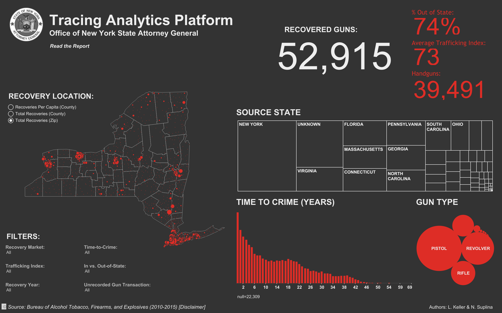
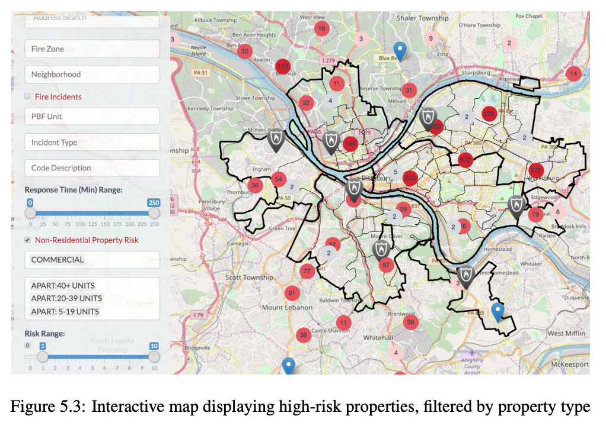
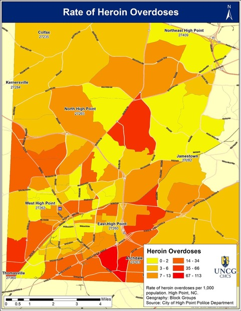

# Data Science Overview

| Key           | Value            |
| :--           | :--              |
| Professor     | Gregory Dobler   |
| Email         | gdobler@udel.edu |
| Office        | Graham Hall 272  |
| Office Hours  | TBD              |
| Class Website | TBD              |

## Samples
### Target on Trafficking
> New York Crime Gun Analysis

### Predictive Modeling of Building Fire Risk
> Metro21: Smart Cities Initiative

### Mapping Opioid Deaths in Guilford County
> Rate of Heroin Overdoses

### “Data-Driven Policy”
> San Francisco just showed us how it should work.

### NASA Satellite Measures Deforestation

# Lab

## Global Mean Sea Level
[https://www.star.nesdis.noaa.gov/sod/lsa/SeaLevelRise/LSA_SLR_timeseries.php](https://www.star.nesdis.noaa.gov/sod/lsa/SeaLevelRise/LSA_SLR_timeseries.php)

[day_1_Water_Level.ipynb](day_1_Water_Level.ipynb)
